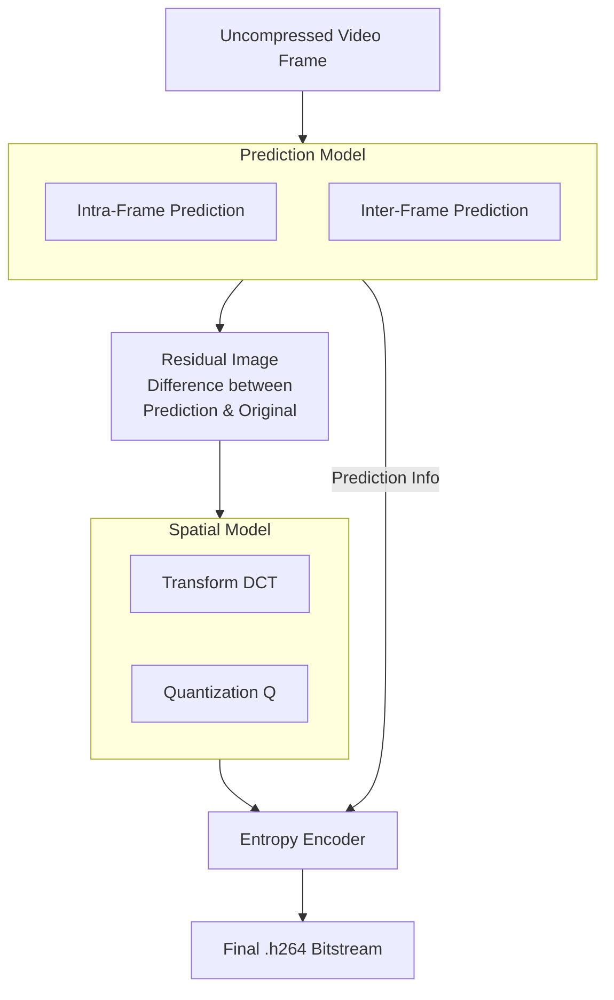

# h264-from-scratch
h.264 encoder from scratch

# Study Notes
* There are I-frames, B-frames and P-frames
* I-frame tends to be the initial image
* P-frames are the differences between frames over time
* B-frames are used to capture change in frame from one frame to the next. Basically a change could be in the same place at different times of the moving picture and you can capture that.

# Color Spaces
* RGB - Captures color between the 3 primary colors
* YCrCb - more sensitive for the human visual system. (There is a cool story about how they made color TV and black and white TVs work with the same signal with b;lack and white tvs just reading the Y value.)
  * Y - Luma
  * Cb - Chroma blue. range of colors between blue and yellow
  * Cr - Chroma red range of colors between red and green
* There are various ways of converting between the 2 based on standards. I think one is BT.601 or something like that and that formular looks similar to this after normalising from 0-255 to the 0 -1 range
  * Y = (0.299 x R) + (0.587 x G) + (0.114 x B)
  * Cb = 0.564 x (B - 7)
  * Cr = 0.713 x (R - 7)
* h264 uses YCC for obvious saving on information and is more perceptible to the HVS (human visual system)
  

# Chroma Subsampling
- When deriving encoded video we need to determine our chroma subsampling to derive color
- This is how we will sample the color from each frame
- It is represented in the J:a:b notation
  - The J:a:b Notation (e.g., 4:2:2):
    - `J`: A reference block of J pixels wide (almost always 4). This number defines the horizontal sampling grid.
    - `a`: The number of chroma samples (Cr, Cb) in the first row of the J-pixel block.
    - `b`: The number of chroma samples (Cr, Cb) in the second row of the J-pixel block (if b is 0, it often means the second row is a copy of the first).

- Common Schemes:

  - 4:4:4 - No Subsampling:
    For every 4x2 block of pixels, you have 4 Y samples, 4 Cb samples, and 4 Cr samples.
    No color detail lost. Used for high-end video production and digital cinema.

  - 4:2:2 - Horizontal Subsampling:
    For a 4x2 block, you have 4 Y samples, but only 2 Cb and 2 Cr samples.
    The chroma is sampled at half the horizontal resolution. Full vertical color resolution.
    Use Case: High-quality professional video editing (e.g., ProRes HQ). You've cut chroma data by 50%.

  - 4:2:0 - Horizontal & Vertical Subsampling:
    For a 4x2 block, you have 4 Y samples, but only 1 Cb and 1 Cr sample that is shared for the entire 2x2 area.
    The chroma is sampled at half the horizontal and half the vertical resolution.
    Use Case: This is the king of consumer video. Used in Blu-ray, streaming (H.264, H.265), web video. You've cut chroma data by 75% with minimal perceptual loss.

# Intermediate Formats
- Largely legacy
  - CIF (Common Intermediate Format): 352 x 288 pixels.
    This was a compromise resolution that was easier for both NTSC and PAL TV systems to handle.

  - QCIF (Quarter CIF): 176 x 144 pixels.
Literally a quarter of the CIF area (half the width, half the height).

  - SQCIF (Sub-Quarter CIF): 128 x 96 pixels.
Even smaller than QCIF. Used for the absolute lowest bitrate connections.

# SD and HD Formats
This is the evolution from standard TV to modern high-definition.

- SD (Standard Definition):
    - The resolution of old analog TVs.
    Examples:
    - 480i/480p (NTSC): ~720 x 480 pixels
    - 576i/576p (PAL): ~720 x 576 pixels

- HD (High Definition):
    - A significant jump in quality.
    Examples:
    - 720p (HD Ready): 1280 x 720 pixels. Progressive scan.
    - 1080i / 1080p (Full HD): 1920 x 1080 pixels. This was the gold standard for Blu-ray and broadcast for many years.

- UHD (Ultra High Definition) / 4K:
  - 3840 x 2160 pixels. The current standard for streaming and modern TVs.

# Quality Measurement

A) Subjective Measurement: 
This is about how the video looks to a human being.

How it's done: A group of human viewers watch original and compressed video sequences under controlled conditions. They score the quality based on how annoying the distortions are.

Common Test: Double Stimulus Impairment Scale (DSIS). Viewers are shown the original (reference) video, then the compressed (test) video, and then asked to rate the test video on a scale like:

5 - Imperceptible

4 - Perceptible, but not annoying

3 - Slightly annoying

2 - Annoying

1 - Very annoying

Benefit: It's the only way to measure perceived quality, which is what ultimately matters.

Drawback: Extremely slow, expensive, and cannot be automated.

B) Objective Measurement: The "Automated Approximation"
This uses a mathematical formula to predict what a subjective score would be. It's what encoders use to tune themselves in real-time.

PSNR (Peak Signal-to-Noise Ratio):

What it is: The most common, simple objective metric. It calculates the mean squared error between the original and compressed pixel values and expresses it as a logarithmic ratio.

Calculation: PSNR = 10 * log10( (MAX^2) / MSE ) where MAX is the maximum possible pixel value (e.g., 255) and MSE is Mean Squared Error.

Drawback: It's a purely mathematical difference and often correlates poorly with human perception. A video can have a high PSNR but look terrible to a human due to a specific type of artifact.

SSIM (Structural Similarity Index):

What it is: A smarter metric that tries to model human perception by comparing luminance, contrast, and structure between the two images.

Benefit: Correlates much better with subjective quality than PSNR.

Result: A value between 0 and 1, where 1 is a perfect match.

VMAF (Video Multi-method Assessment Fusion):

What it is: The state-of-the-art, developed by Netflix. It's a machine learning model that fuses several elementary metrics (including ones like PSNR and SSIM) and trains itself on a massive database of human subjective scores.

Benefit: It's the closest an automated tool has come to replicating human judgment. It's excellent for comparing codecs and encoder settings for streaming applications.

In a Nutshell: For H.264, you'll use PSNR for simple, quick comparisons, but for any serious quality tuning (especially for streaming), the industry is moving towards VMAF.

# Codecs
An uncompressed video is massive because it's full of redundancy:

Spatial Redundancy: Neighboring pixels in a frame are often very similar (e.g., a blue sky).

Temporal Redundancy: Consecutive frames are often very similar (e.g., a static background).

The codec's job is to find and remove these redundancies, leaving only the new information that needs to be sent.

## Step 1: The Prediction Model ("What Can We Guess?")

This is the most important step. Instead of encoding the raw pixels, the encoder first tries to predict them. The difference between this prediction and the actual image is what gets encoded. There are two main types of prediction:

#### A) Intra-Frame Prediction (Spatial Prediction - for I-frames):

Concept: For the current block, look at its already-encoded neighboring blocks within the same frame and predict what it should look like.

Analogy: You're doing a paint-by-numbers. You see the surrounding cells are all light blue. Instead of the instructions saying "paint this cell light blue," it just says "this cell is the same as the one above it."

How: H.264 has several "directions" (modes) like "copy from the left," "copy from above," or a "diagonal average." The encoder picks the best one.

#### B) Inter-Frame Prediction (Temporal Prediction - for P/B-frames):

Concept: For the current block, search for a similar block in a previously encoded frame (a "reference frame"). Instead of encoding the block's pixels, you just encode a motion vector.

Analogy: In your flipbook, instead of redrawing the entire car, you just draw an arrow saying "copy the car from the previous page and move it 2cm to the right."

How: This is Motion Estimation. The motion vector is just a (x, y) coordinate telling the decoder where to copy from. This is incredibly efficient.

The output of this stage is the Residual (the difference between the prediction and the real image) and the Prediction Info (motion vectors or intra-mode directions).

## Step 2: The Spatial Model ("Compressing the Leftovers")

The Residual image is the part of the image the predictor couldn't guess. It's the detail, noise, and edges. It's usually made of small numbers and doesn't have sharp, predictable patterns, so we can't predict it easily. Instead, we compress it using frequency analysis.

#### A) Transform (DCT - Discrete Cosine Transform):

Concept: It takes a block of the residual (e.g., 4x4 or 8x8 pixels) and converts it from the spatial domain (pixel values) into the frequency domain.

Analogy: Imagine a complex musical chord. The DCT is like breaking that chord down into a list of the individual pure notes (frequencies) and their volumes (amplitudes) that make it up.

Why? In the frequency domain, the "energy" of the residual is concentrated into just a few important coefficients (the low frequencies). The many high-frequency coefficients are often close to zero.

#### B) Quantization (Q):

Concept: This is the primary step where information is lost and compression happens. It deliberately reduces the precision of the frequency coefficients from the DCT.

How: Each coefficient is divided by a Quantization Parameter (QP) and rounded to the nearest integer. A larger QP means more rounding.

Analogy: You have the measurements 4.1, 3.9, and 4.2. You decide to "quantize" them by rounding to the nearest whole number. You now have 4, 4, and 4. You've lost the fine detail, but you've made the data much simpler (three 4s instead of three different numbers).

Result: After quantization, most of the high-frequency coefficients become 0. This creates long runs of zeros, which are very easy to compress in the next stage.

## Step 3: The Entropy Encoder ("Final Squeeze")

This is the final, lossless compression stage. It takes all the data that remains and encodes it into the most efficient binary representation possible.

What it encodes:

The quantized DCT coefficients (which are now mostly zeros).

The prediction info (motion vectors & intra modes).

Headers and other overhead.

How it works: It uses statistical models. Symbols that occur more frequently (like a 0 or a common motion vector value) are assigned the shortest binary codes. Symbols that are rare get longer codes. CABAC (Context-Adaptive Binary Arithmetic Coding) is the advanced method used in H.264.

Analogy: Morse code. The most common letter in English, 'E', is a single dot .. The rare letter 'Q' is --.-. Entropy coding does the same thing for video data.

The output of the Entropy Encoder is the final .h264 bitstream, ready for storage or transmission.

The decoder does this same process but in reverse.

the encoding process is compute intensive, decoding is not so much
